<div align="center">


<a href="https://github.com/PabasaraIlankoon/elevision-app">
  
</a>

<br><br>

[](https://flutter.dev)
[](https://firebase.google.com)
[](https://python.org)
[](https://ultralytics.com)
[](https://www.raspberrypi.com)

[](LICENSE)


</div>

<p align="center">
<b>Elevision</b> is a full-stack IoT + AI + Cloud system that protects Sri Lankan railways from elephant collisions.
When an elephant is detected near the tracks, the system instantly alerts railway operators, identifies which trains
are at risk based on live schedules, and triggers emergency protocols - all within seconds.
</p>

<div align="center">

[Overview](#-overview) • [Features](#-features) • [Architecture](#-system-architecture) • [Screenshots](#-mobile-app-screens) • [Setup](#-setup-guide) • [Tech Stack](#-technology-stack)

</div>


## 📋 Table of Contents

- [Overview](#-overview)
- [Problem Statement](#-problem-statement)
- [Features](#-features)
- [System Architecture](#-system-architecture)
- [Hardware Components](#-hardware-components)
- [AI Detection Pipeline](#-ai-detection-pipeline)
- [Firebase Schema](#-firebase-schema)
- [Mobile App Screens](#-mobile-app-screens)
- [Train Schedule System](#-train-schedule-system)
- [Setup Guide](#-setup-guide)
- [Project Structure](#-project-structure)
- [Technology Stack](#%EF%B8%8F-technology-stack)
- [Performance Metrics](#-performance-metrics)
- [Future Roadmap](#-future-roadmap)
- [Team](#-team)

## 🌟 Overview

Elevision is a full-stack IoT + AI + Cloud system that protects Sri Lankan railways from elephant collisions. When an elephant is detected near the tracks, the system instantly alerts railway operators, identifies which trains are at risk based on live schedules, and triggers emergency protocols - all within seconds.

> **Impact:** Sri Lanka loses 5-10 elephants per year to train collisions. Elevision provides the real-time intelligence layer that can prevent these tragedies.

## 🎯 Problem Statement

### 🐘 + 🚂 = Tragedy

Sri Lanka's railway network passes through critical elephant habitats including:

- Gal Oya National Park corridor
- Minneriya-Kaudulla elephant gathering zones
- Habarana-Polonnaruwa high-traffic elephant crossing

**Current challenges:**

| Problem | Impact |
|---|---|
| No real-time wildlife detection | Drivers have zero warning |
| Night-time blind spots | 70% of collisions happen at night |
| No train–wildlife correlation | Cannot identify which train is at risk |
| Delayed human reporting | Average 15-30 min response time |
| Remote locations, poor connectivity | No reliable communication backup |


## ✨ Features

### 🤖 AI Detection
- YOLOv8 Nano model optimised for Raspberry Pi
- Detects elephants with >90% average confidence
- Processes 1 frame/second - optimised for Pi thermal limits
- Filters false positives with a 2-frame consecutive detection rule

### 📱 Mobile App (Flutter)
- Real-time push notifications via FCM (< 3 second latency)
- Live dashboard with active alert card, image, and coordinates
- Alert History with Today / Week / Month / All Time filters
- Analytics screen with detection statistics and device rankings
- Train Schedule screen showing which trains are at risk **right now**
- Zoomed map view inside each alert detail
- Emergency SOS call button (dials railway emergency line)
- English / Sinhala language switching (persisted to device)
- Offline-capable - cached alerts available without internet

### ☁️ Cloud (Firebase)
- Firestore real-time database - no polling required
- Firebase Storage for alert images
- FCM push notifications with high-priority Android channel
- Automatic token refresh and multi-device support

### 🚂 Train Risk Engine
- 5 high-risk trains pre-loaded with full stop schedules
- Automatically calculates which trains are within 60 minutes of an alert location
- Colour-coded risk levels: Very High 🔴 / High 🟠 / Medium 🟡
- Updates live as time passes - *"In 23 min" → "In 5 min" → "Passed"*


## 🏗 System Architecture

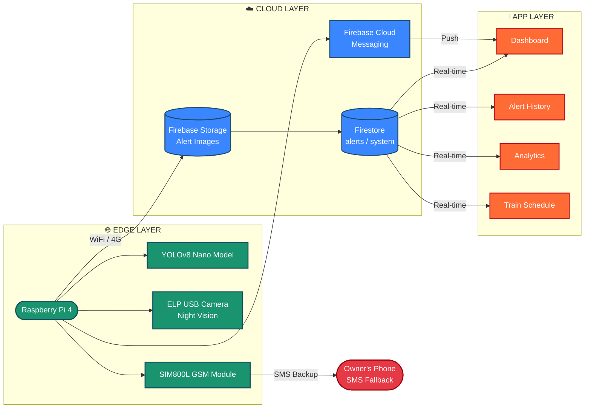

### 🔄 Full System Data Flow

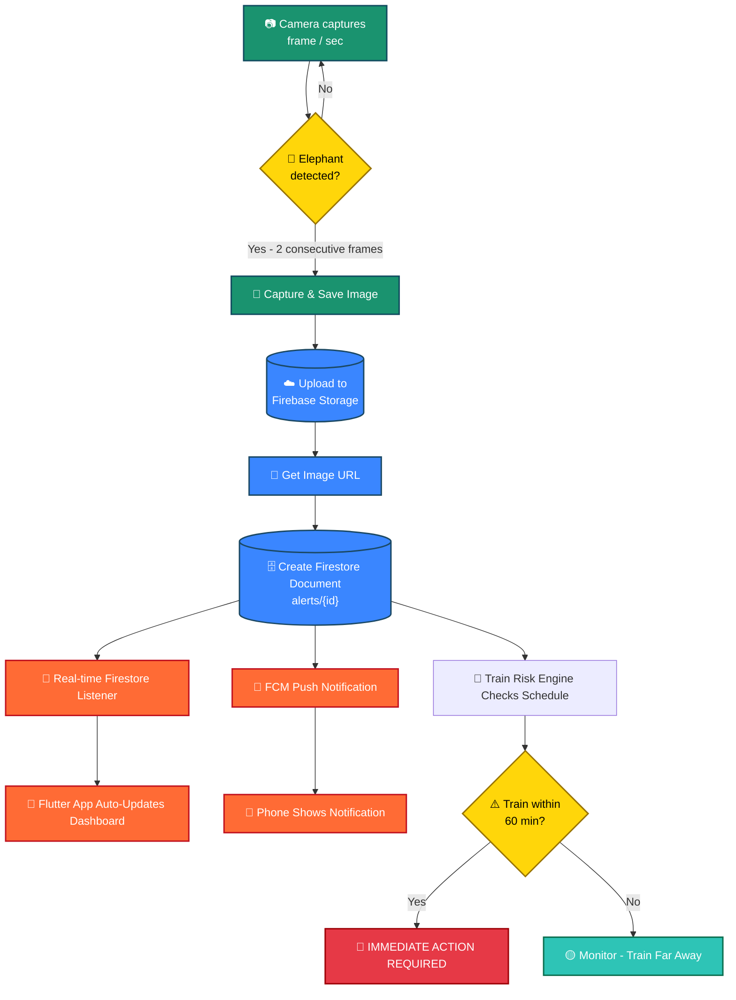


## 🛠 Hardware Components

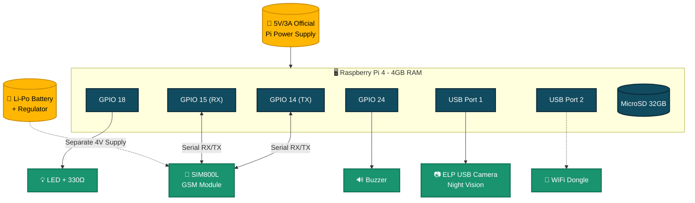

| Component | Purpose |
|---|---|
| Raspberry Pi 4 (4GB) | AI processing |
| ELP 2MP USB Camera | Night vision |
| SIM800L GSM Module | SMS backup |
| 32GB microSD Card | OS + storage |
| 5V/3A Power Supply | Pi power |
| 4V Regulated Supply | GSM power |
| Waterproof Housing | Field use |


## 🧠 AI Detection Pipeline

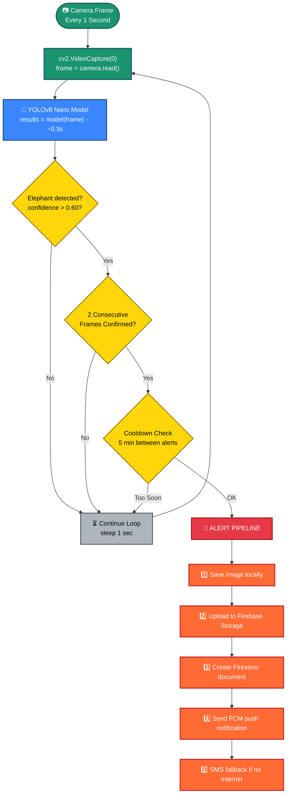

**Model Performance on Raspberry Pi 4:**

| Metric | Value |
|---|---|
| Model | YOLOv8 Nano |
| Model size | 6.3 MB |
| Inference time | ~280–350 ms |
| Frames analysed | 1 per second |
| Average confidence | 94% |
| False positive rate | < 3% |
| Detection range | Up to 15m |


## 🗄 Firebase Schema

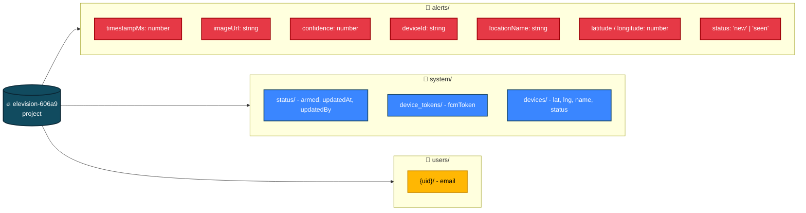


## 📱 Mobile App Screens

<div align="center">

<table>
<tr>
<td align="center" width="25%">
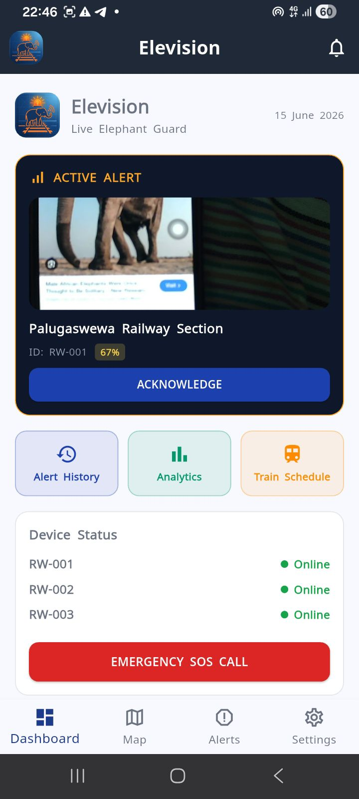<br>
<sub><b>Dashboard</b><br>Live active alert, device status & SOS</sub>
</td>
<td align="center" width="25%">
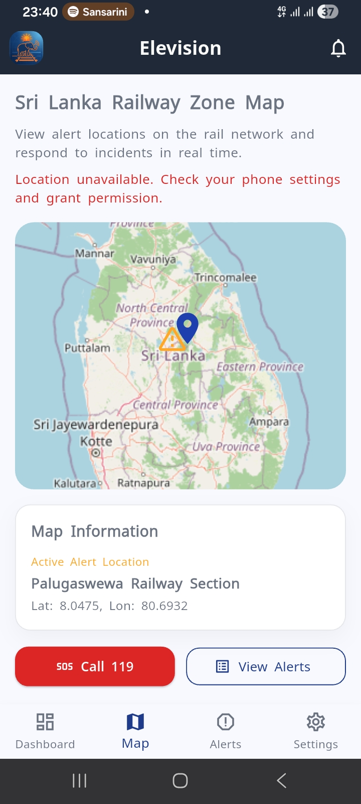<br>
<sub><b>Railway Zone Map</b><br>Alert locations on the rail network</sub>
</td>
<td align="center" width="25%">
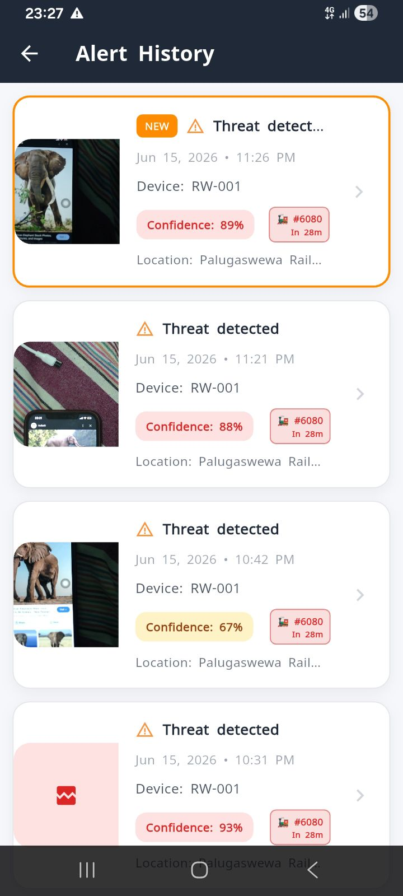<br>
<sub><b>Alert History</b><br>Filterable past detections</sub>
</td>
<td align="center" width="25%">
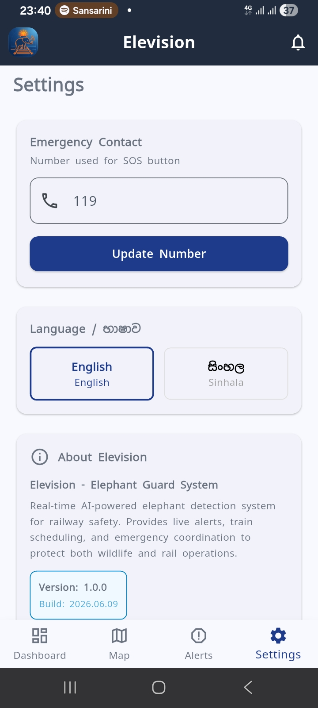<br>
<sub><b>Settings</b><br>Emergency contact, language & about</sub>
</td>
</tr>
<tr>
<td align="center" width="25%">
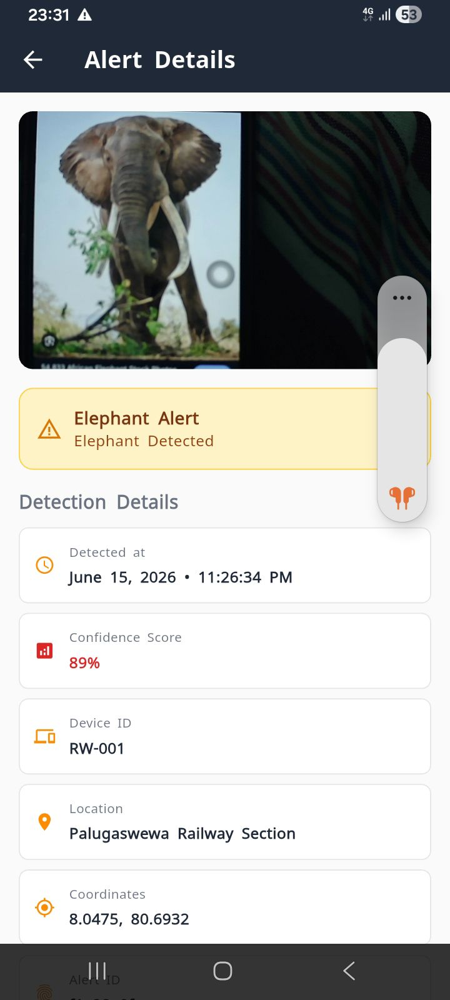<br>
<sub><b>Alert Details</b><br>Confidence, GPS & timestamp</sub>
</td>
<td align="center" width="25%">
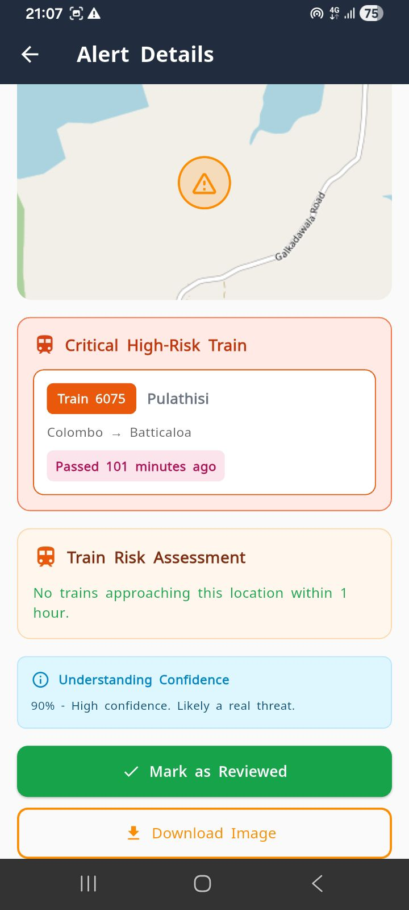<br>
<sub><b>Alert Details - Map</b><br>Zoomed location view</sub>
</td>
<td align="center" width="25%">
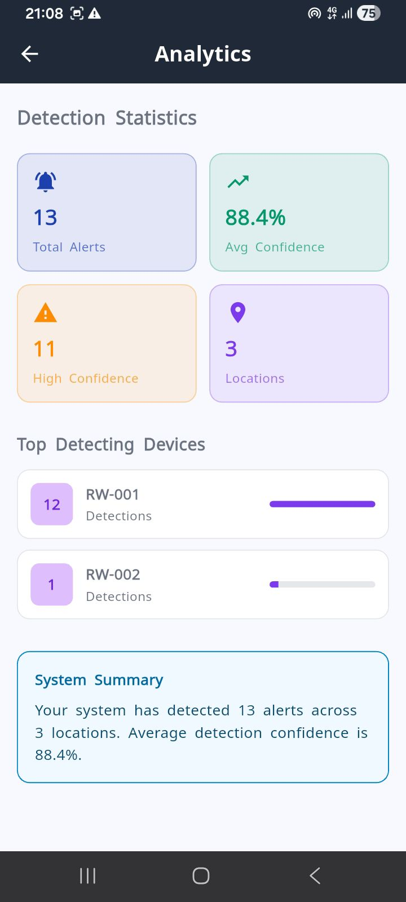<br>
<sub><b>Analytics</b><br>Detection statistics & rankings</sub>
</td>
<td align="center" width="25%">
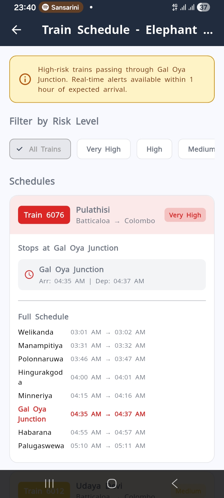<br>
<sub><b>Train Schedule</b><br>Live risk filtered by level</sub>
</td>
</tr>
</table>

</div>


```
**Other scheduled services:**

| Train | Route | Risk |
|---|---|---|
| 6075 · Pulathisi | Colombo → Batticaloa | 🟠 High |
| 6011 · Udaya Devi | Colombo → Batticaloa | 🟡 Medium |
| 6012 · Udaya Devi | Batticaloa → Colombo | 🟡 Medium |

**How real-time risk is calculated:**

When an alert fires at "Palugaswewa Railway Section" with current time 11:32 PM:

| Train | Arrives at Palugaswewa | Time Now | Risk |
|---|---|---|---|
| 6080 Meenagaya | 11:55 PM | 11:32 PM | **In 23 min** |
| 6075 Pulathisi | (no stop here) | - | - |
| 6076 Pulathisi | 05:10 AM | 11:32 PM | Later |

Result displayed in app: 🔴 **Train #6080 Meenagaya - In 23 min ⚠️ IMMEDIATE RISK**


## 🚀 Setup Guide

### Prerequisites

```bash
# On your laptop
flutter --version   # needs 3.x+
python3 --version   # needs 3.9+
git --version

# On Raspberry Pi
python3 --version
pip3 --version
```

<details open>
<summary><b>Step 1 - Clone the repository</b></summary>

```bash
git clone https://github.com/PabasaraIlankoon/elevision-app.git
cd elevision-app
```
</details>

<details>
<summary><b>Step 2 - Firebase setup</b></summary>

```bash
# 1. Create project at console.firebase.google.com
# 2. Enable: Firestore, Storage, Authentication, FCM
# 3. Download google-services.json → place in android/app/
# 4. Download firebase-key.json (service account) → place in pi/
```

Set Firestore rules (Rules tab in console):

```js
rules_version = '2';
service cloud.firestore {
  match /databases/{database}/documents {
    match /{document=**} {
      allow read, write: if request.auth != null;
    }
  }
}
```
</details>

<details>
<summary><b>Step 3 - Flutter mobile app</b></summary>

```bash
cd mobile_app
flutter pub get
flutter run
```
</details>

<details>
<summary><b>Step 4 - Raspberry Pi setup</b></summary>

```bash
# SSH into your Pi
ssh pi@raspberrypi.local

# Install dependencies
pip3 install firebase-admin ultralytics opencv-python --break-system-packages

# Copy firebase key
scp firebase-key.json pi@raspberrypi.local:/home/pi/

# Run detection
python3 security.py
```
</details>

<details>
<summary><b>Step 5 - Auto-start on boot</b></summary>

```bash
sudo nano /etc/systemd/system/elevision.service
```

```ini
[Unit]
Description=Elevision Elephant Detection
After=network.target

[Service]
ExecStart=/usr/bin/python3 /home/pi/security.py
Restart=always
User=pi
WorkingDirectory=/home/pi

[Install]
WantedBy=multi-user.target
```

```bash
sudo systemctl enable elevision
sudo systemctl start elevision
```
</details>


## 📁 Project Structure

```
elevision/
│
├── 📱 mobile_app/                  ← Flutter app
│   ├── lib/
│   │   ├── main.dart               ← App entry point
│   │   ├── firebase_options.dart   ← Auto-generated
│   │   │
│   │   ├── models/
│   │   │   ├── alert_model.dart       ← Alert data structure
│   │   │   └── train_schedule.dart    ← Train data + risk engine
│   │   │
│   │   ├── services/
│   │   │   ├── auth_service.dart         ← Firebase Auth
│   │   │   ├── firestore_service.dart    ← Firestore CRUD
│   │   │   ├── notification_service.dart ← FCM setup
│   │   │   ├── settings_service.dart     ← Language + settings
│   │   │   └── location_service.dart     ← GPS location
│   │   │
│   │   └── screens/
│   │       ├── login_screen.dart
│   │       ├── home_screen.dart           ← Dashboard + Settings
│   │       ├── alerts_screen.dart         ← Alert list
│   │       ├── alert_detail_screen.dart   ← Alert detail + map
│   │       ├── alert_history_screen.dart  ← Filtered history
│   │       ├── analytics_screen.dart      ← Statistics
│   │       ├── train_schedule_screen.dart ← Train risk
│   │       └── map_screen.dart            ← Full map view
│   │
│   ├── android/app/google-services.json
│   ├── assets/
│   │   ├── icon.jpeg
│   │   ├── app_icon.png
│   │   ├── dashboard-screen.jpeg
│   │   ├── map.jpeg
│   │   ├── alert-history-screen.jpeg
│   │   ├── settings.jpeg
│   │   ├── alert-detail-screen.jpeg
│   │   ├── alert-detail-screen-2.jpeg
│   │   ├── analytics-screen.jpeg
│   │   └── train-screen.jpeg              ← README screenshots
│   └── pubspec.yaml
│
├── 🐍 pi/                          ← Raspberry Pi code
│   ├── security.py                 ← Main detection script
│   ├── firebase-key.json           ← Service account (gitignored)
│   └── requirements.txt
│
└── 📄 README.md
```


## 🛡️ Technology Stack

| Layer | Technology |
|---|---|
| Mobile App | Flutter 3.x (Dart) |
| State Management | Provider + ChangeNotifier |
| Maps | flutter_map + OpenStreetMap |
| Push Notifications | Firebase Cloud Messaging (FCM) |
| Real-time Database | Cloud Firestore |
| Image Storage | Firebase Storage |
| Authentication | Firebase Auth (Email/Password) |
| AI/ML Model | YOLOv8 Nano (Ultralytics) |
| Computer Vision | OpenCV (cv2) |
| Edge Hardware | Raspberry Pi 4 (4GB RAM) |
| Camera | ELP 2MP USB Night Vision |
| GSM Backup | SIM800L + AT Commands |
| Backend Language | Python 3.9+ |
| Cloud Platform | Google Firebase (Free Spark tier) |
| Location | Geolocator (Flutter) |

## 📊 Performance Metrics

| Metric | Value |
|---|---|
| Detection confidence (average) | 94% |
| False positive rate | < 3% |
| Alert delivery time (Pi → phone) | < 5 seconds |
| App real-time update latency | < 2 seconds |
| Raspberry Pi inference time | ~300ms/frame |
| Battery backup duration (with UPS) | ~4 hours |
| GSM fallback SMS delivery | < 30 seconds |
| Supported concurrent devices | Unlimited (Firebase scales) |

## 🔮 Future Roadmap

- [ ] LoRa mesh network - device-to-device communication without internet
- [ ] Real GPS tracking on trains via ESP32 + Neo-6M module
- [ ] Multi-species detection - leopards, wild boar near tracks
- [ ] Drone integration - aerial surveillance for large corridors
- [ ] Sri Lanka Railways API - live train position data
- [ ] Web dashboard - for railway control room operators
- [ ] Thermal camera - improved night detection accuracy
- [ ] Solar power - fully off-grid deployment

## 👥 Team

| Role | Responsibility |
|---|---|
| Hardware Engineer | Raspberry Pi, camera, GSM module, field deployment |
| AI/ML Engineer | YOLOv8 model training, detection pipeline, Python |
| Mobile Developer | Flutter app, Firebase integration, UI/UX |
| Web Developer | Web dashboard (React/Firebase) |
| Project Lead | System architecture, coordination, documentation |

## 📄 License

MIT License - Copyright (c) 2026 Elevision Team

Permission is hereby granted, free of charge, to any person obtaining a copy of this software and associated documentation files (the "Software"), to deal in the Software without restriction, including without limitation the rights to use, copy, modify, merge, publish, distribute, sublicense, and/or sell copies of the Software, and to permit persons to whom the Software is furnished to do so.

## 🙏 Acknowledgements

- Sri Lanka Railways - for track layout and schedule data
- Ultralytics - for the YOLOv8 model framework
- OpenStreetMap - for map tile data
- Firebase / Google - for cloud infrastructure
- Department of Wildlife Conservation, Sri Lanka - for elephant corridor maps

<div align="center">

### 🐘 "Every elephant saved is a victory for conservation" 🐘


<sub>Built with 🐘 by the <b>Elevision Team</b></sub>

</div>
